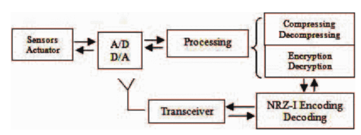
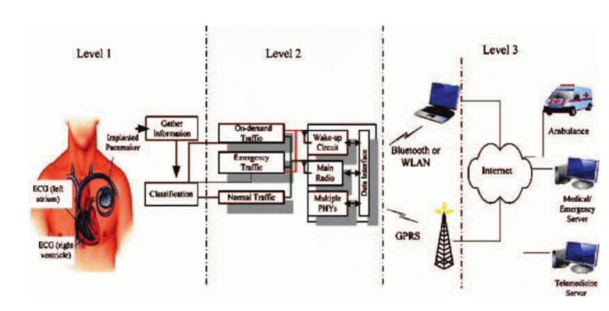
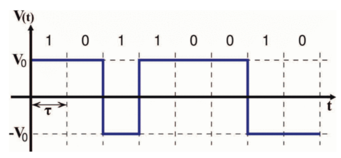
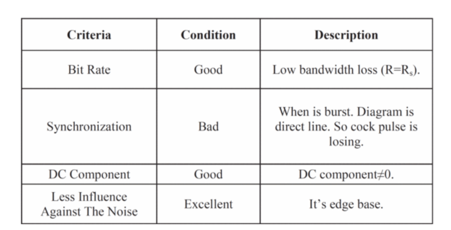
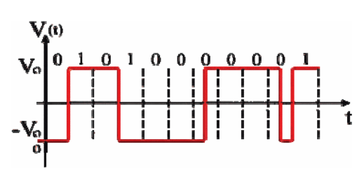

## Data Communications (CO250): Mini-Project :: Introduction file

* According to the World Health Organisation (WHO) ,   cardiovascular disease causes 30 percent of all deaths
in the world.

* Wireless Body Area Network (WBAN) monitors human
physiological signs at home, in hospital and even when
moving and transmits sick vital signs to medical
database.

* In data transmission process most of the energy is spent on commnuication. So, improvement in the data transmission method has great importance.

* So finding the new methods in communication and
transmission can be a valuable step in quickly to wrap
up this technology.

**Wireless Body Area Network (WBAN)**

* WBAN is a set of independent nodes such as sensors
and actuators that are situated deeply in tissues, under
the skin, on the body or in the clothes .

* WBAN emerged as a new technology for E-healthcare ,communicated using short-range wireless communication techniques and allows the data and parameters of a patient's vital body move to be collected in medical database

* As shown, sensors detect vital signs which are in analog
form. Next convert them to digital.

* Then CPU processes the data (Compression and
Encryption for decrease in Bandwidth consumption and
increase data security for data transmission).

* The data send to receiver by digital to digital encoding
NRZ-I.

* The receiver does this step vice versa to achieve main
data.

**WBAN Total Architecture**

**1) First Level**
The first level is a set of intelligent sensors and actuator or
nodes.

**2) Second Level**
The second level is the personal server (personal digital
assistant, cell-phone or PC).Here collects patient vital data
from nodes.

**3) Third Level**
The third level encompasses remote servers that manage
patient medical information.

**Bio Signal**

* Bio signal is a short term for type of signal that can
measure and control live creature's vital signs
continuously.

* In fact, the sensors located in/on any organ for
measure electrical current and electrical resistance
changes and report gained values.

* Incompatibility of values with standard values, means
disorder in organ. If this happens, PDA warns
disruptions to person.

**NRZ-I DIGITAL TO DIGITAL ENCODING**

* “I” i.e. inverse. “Z” i.e. zero that shows zero voltage
level. “1” shows if in start of bit interval signal polarity
would be inverse, the bit equals “1”.

* If in start of bit interval hasn't change level, the bit
equals “0”.

* NRZ-I is a differential method that less affected by the
noise.

**WBAN’S CERITERIA**

The most important WBAN bio signal transmission
criteria are as follows:

* High bit rate
* Sync problem (Long string of one or zero will be lost in
time)
* Reducing or eliminating the DC (Direct Current)
component
* Less influence from noise

**MODIFIED NRZ-I (MNRZ-I)**

For solving the synchronization problem (Clock loses)
between transmitter and receiver also for inappropriate
DC component in NRZ-I encoding, we do as follows

A. Synchronization

Every bits clock send with its signal, but for bandwidth
loss prevention instead in all of bits send with its clock,
after every two zero bits, only third zero bit send with its
clock. With this process, receiver will able to detect
repeated more than two zero bits similar to each other and
prevents from asynchronous between transmitter and
receiver.

B. DC Component

With the change made is clear that area under the diagram
is close to zero. It's an improvement on DC component.

