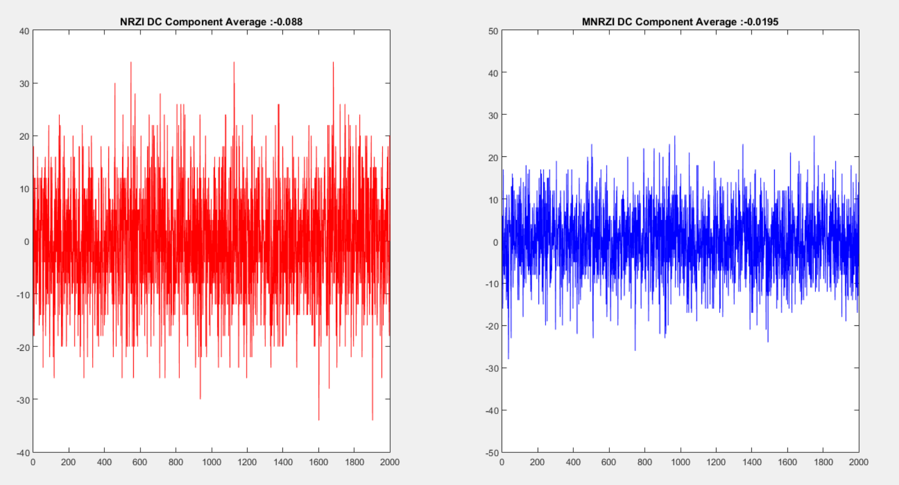

## Data Communications (CO250): Mini-Project

**TITLE:**

A Modified Digital to Digital Encoding Method to Improve the Wireless Body Area Network(WBAN) Transmission

This CO250-MP-130-132 repository is a joint Matlab assignment of Data Communication.

**HOW TO CLONE:**

Follow the steps given below: 
- git -c http.sslVerify=false clone http://10.100.13.215/16CO132/CO250-MP-130-132.git 
- cd CO250-MP-130-132
- Now follow the instructions given at the end in README.md in this repository
- Pull Requests welcome

**SOFTWARE REQUIREMENTS:**

- Install git
- Install matlab

**MEMBERS:**

Bobby G. Patil (16CO130) - <bobbypt05@gmail.com>

Chetan R. Prajapati (16CO132) - <crprajapati111@gmail.com>

**ABSTRACT:**

In the era of digitalization, the online healthcare services play the vital role. Such healthcare services use Wireless Body Area Network (WBAN), which is a set of independent nodes that are situated in tissues on the human body, or in the clothes. WBAN monitors human physiological signs and transmits sick vital signs to medical database using bio signals. The accuracy in bio signal transmission is important. Generally bio signal transmission uses the NRZ-I digital to digital encoding method. But NRZ-I signal contains DC component. This DC component causes the synchronization problem at the transmitter and receiver of the bio signal. For solving the synchronization problem (Clock loses) between transmitter and receiver also for inappropriate DC component in NRZ-I encoding, modified NRZ-I (MNRZ-I) method is proposed. This MNRZ-I method improves DC component up to 75%, which in turn reduces the synchronization problem. This increases the accuracy in bio signal transmission. 

**OBJECTIVES:**

* To represent the NRZ-I and MNRZ-I plot for the given sequence     	of input bit stream.  
* To show the plot of comparison of Average DC Component 	between NRZ-I and MNRZ-I.  

**REFERENCES:**

Ehsan Abedini, Abdalhossein Rezai, "A Modified Digital to Digital Encoding Method to Improve the Wireless Body Area Network(WBAN) Transmission", Knowledge-Based Engineering and Innovation (KBEI), 2015 [Click Here](http://ieeexplore.ieee.org/document/7436193/?reload=true)

**FILE STRUCTURE:**

* Introduction.md - This file explain theoretical aspects of the project. 

* Design.md - This file explain design aspects of the mini project.

* MAIN_FILE.m - Main Matlab code.

* NRZI.m - Matlab code for Non Return To Zero Inverted.

* MNRZI.m - Matlab code for Modified Non Return To Zero Inverted.

* NRZIPLOT.m - Matlab code for Plotting Non Return To Zero Inverted.

* MNRZIPLOT.m - Matlab code for Plotting Modified Non Return To Zero Inverted.

* MAIN_PLOT.m - Matlab code for Plotting Main Results.

* diagram_1.png - Contains diagrams used in Introduction file.

* diagram_2.png - Contains diagrams used in Introduction file.

* diagram_3.png - Contains diagrams used in Introduction file.

* diagram_4.png - Contains diagrams used in Introduction file.

* diagram_5.png - Contains diagrams used in Introduction file.

* Graph_1.png - Graph-1 of result obtained by simulating MNRZI & NRZI.

* Graph_2.png - Graph-2 of result obtained by simulating MNRZI & NRZI.

* Graph_3.png - Graph-3 of result obtained by simulating MNRZI & NRZI.

* Graph_4.png - Graph-4 of result obtained by simulating MNRZI & NRZI.

* Graph_5.png - Graph-5 of result obtained by simulating MNRZI & NRZI.

* result_table.png - Snapshot of Table obtained for comparison by simulating MNRZI & NRZI.

* run_ss.png - Snapshot of How run window looks in matlab.

**HOW TO RUN:**

- After Cloning repository (Mentioned above how to clone) Open the matlab and follow the below instructions.

- NOTE :Now to run this files in matlab make sure that all these 6 files MAIN_FILE.m , NRZI.m, MNRZI.m , MAIN_PLOT.m, NRZIPLOT.m, MNRZIPLOT.m are in same
folder and same directory

- To get the final result of simulation Click on "RUN" button in matlab as shown below in figure:

- So clicking on it Graph will be generated in new window as shown below. It will be containing 2 subplots in it. First one on left is NRZI DC Average component Graph obtained after taking sample of 2000 bits string that every bit string length is 100 bits and they are generated randomly. Second one on right is MNRZI DC Average component Graph obtained after taking sample of 2000 bits string that every bit string length is 100 bits and they are generated randomly.

