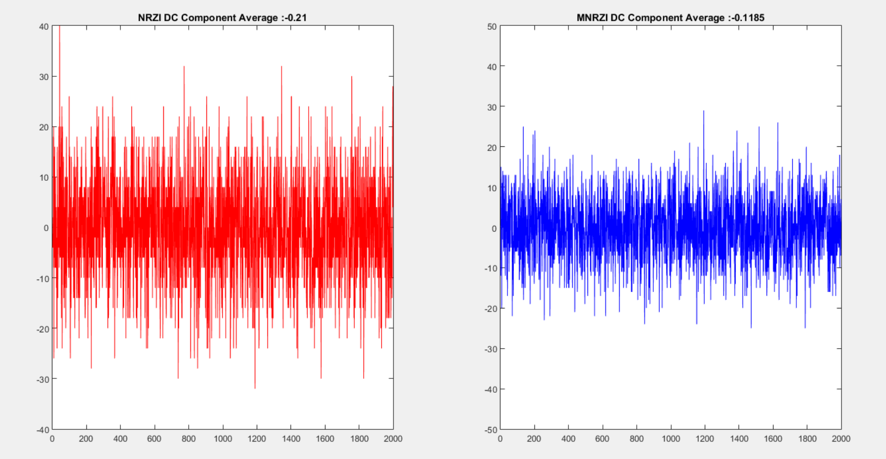
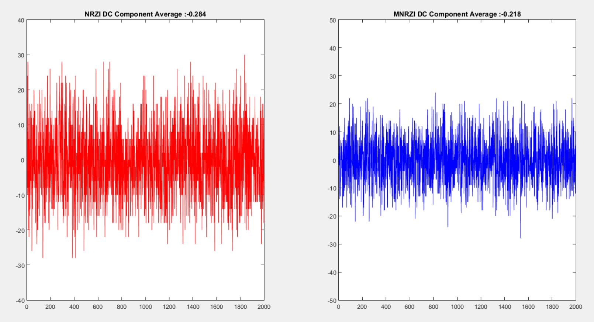
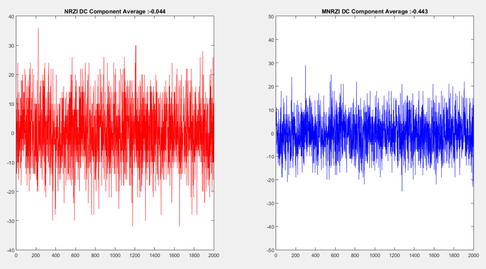
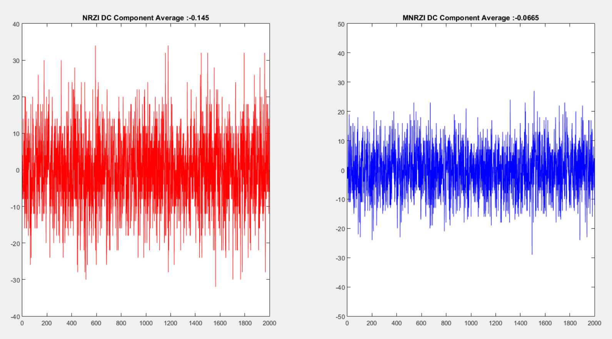
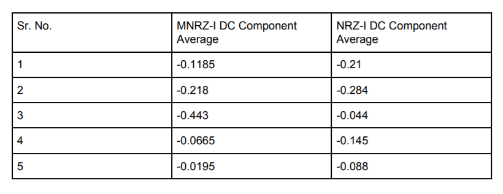

## Data Communications (CO250): Mini-Project :: Results file

* We simulated the proposed method in MATLAB. The sample taken is 2000 bits string that every 
bit string length is 100 bits and they are generated randomly.Then, we plotted the average DC
component graph for both NRZ-I and MNRZ-I.We have taken into consideration 5 examples for which
the graph for comparison and result table is shown below: 

Graphs:

This is the first graph we obtained from our simulation.
DC Average Component for NRZI is -0.21 & for MNRZI is -0.1185.So MNRZI is better compared to NRZI. 

This is the second graph we obtained from our simulation.
DC Average Component for NRZI is -0.284 & for MNRZI is -0.218.So MNRZI is better compared to NRZI. 

This is the third graph we obtained from our simulation.
DC Average Component for NRZI is -0.044 & for MNRZI is -0.443.For this case due to random generation of number NRZI is better compared to MNRZI. 

This is the fourth graph we obtained from our simulation.
DC Average Component for NRZI is -0.145 & for MNRZI is -0.0665.So MNRZI is better compared to NRZI. 

This is the fifth graph we obtained from our simulation.
DC Average Component for NRZI is -0.088 & for MNRZI is -0.0195.So MNRZI is better compared to NRZI.So Average component in MNRZ-I can be improved upto 75%. 

These are the results obtained by generating 2000 bit string randomly and results are recorded in table as given below.

Result Table:

